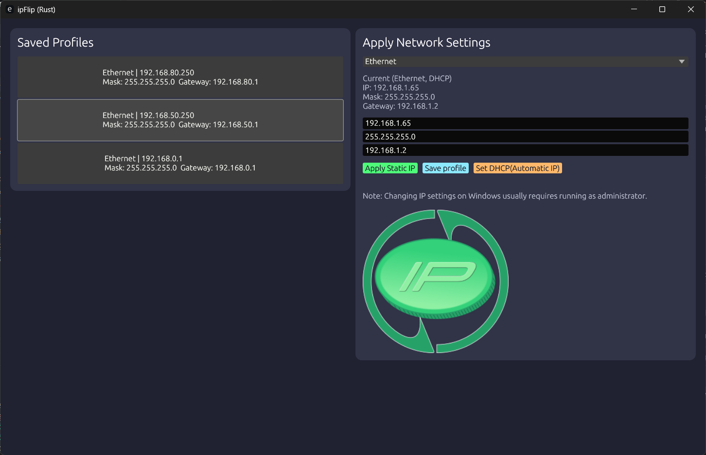

# ipFlip
 
ipFlip created  to quickly change ip address, with frequently used ip list

* Requires admin privileges!

- Interface ordering: physical wired first, then physical wireless, then everything else.
- Applies static IP or DHCP using `netsh`.
- Stores profiles in `%APPDATA%\\ipFlip\\ip_profiles.json`.
- Loads profiles only if `%APPDATA%\\ipFlip\\ip_profiles.json` already exists.
